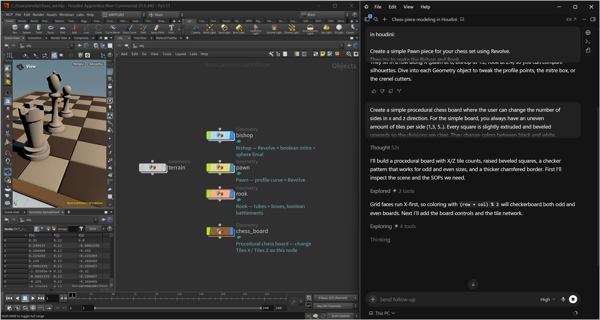

<p align="center"><strong>Cursor talks. Houdini builds. The DCC bridge stays local by default.</strong></p>

<p align="center">
  <a href="https://github.com/Plygonality/Plygon-mcp"></a>
  <a href="../LICENSE"></a>
  
  
  
</p>

# Plygon Houdini MCP

Give Cursor (and its agent models) hands inside SideFX Houdini.

Describe a setup. The agent inspects the hip, creates nodes, wires SOPs, sets parms, and **screenshots the Scene Viewer** so it can judge its own work — the same loop you'd run as a TD, minus the clicking.

Same localhost-TCP + FastMCP shape as the Blender bridge. See [`THIRD_PARTY.md`](../THIRD_PARTY.md).

Fork it from GitHub. Run it on localhost. Own the code.

```
Cursor agent  ──stdio MCP──►  plygon-houdini-mcp  ──TCP 127.0.0.1:9877──►  Houdini listener  ──hou──►  your .hip
```

Cursor showing the MCP **green with tools listed is not enough**. That only means `uvx` started. Houdini must print `PlygonMCP: listening on 127.0.0.1:9877`. Ping from a **local Agent** chat — a Cloud Agent cannot see your PC.

---

## Why this one

Most "AI for Houdini" stacks want your scene in the cloud, or they dump hundreds of tools into the context window.

Plygon is the opposite:

- **Local.** The MCP and Houdini talk on `127.0.0.1:9877`. That's it.
- **No bridge telemetry.** Plygon does not phone home. Cursor may send prompts, scene data, and screenshots to your configured model provider.
- **Small enough to fork.** One Houdini package. One Python server. Read it in an afternoon, then make it yours.
- **Built for Cursor agents.** Structured tools for the boring bits, `execute_houdini_code` for the rest, viewport capture so the model can *see*.

---

## Get it from GitHub

Installing both DCCs? Use the canonical [click-by-click Blender + Houdini guide](../README.md#install-both-mcps--exact-click-by-click-guide).

```bash
git clone https://github.com/Plygonality/Plygon-mcp.git
```

Wait for the clone to finish, then `cd Plygon-mcp`. Press Enter after each command. Never paste `cd` and the next installer on the same line.

Or hit **Fork** — this repo is MIT on purpose.

`uvx` in Cursor's `mcp.json` does **not** install this package. A `.cursor\houdini-mcp` folder is not the repo. A Houdini Console error about that folder, `fxhoudinimcp`, or `help_menu` is a different MCP — click **Close**. Run the installer from this clone (the script finds its own files, so a full path works from any directory).

Install uv first if Step 1 of the [canonical guide](../README.md#step-1--install-uv-once) has not been completed. On Windows, check `& "$env:USERPROFILE\.local\bin\uvx.exe" --version` before rerunning the Astral installer; Cursor often locks `uv.exe`. The installer uses uv's managed Python; a separate global `python` command is not required.

### 1. Install the Houdini package

**Windows** (this `.cmd` file works when PowerShell blocks `.ps1` scripts):

```powershell
.\scripts\install-houdini.cmd
```

Fallback if the `.cmd` is missing:

```powershell
& "$env:USERPROFILE\.local\bin\uv.exe" run --no-project python houdini-mcp\scripts\install_package.py
```

The installer looks for `Documents\houdini21.0` **and** `OneDrive\Documenten\houdini21.0` (Dutch OneDrive). That is `houdini21.0` as the folder name, not `Documents\houdini\21.0`.

If it cannot find prefs, open Houdini once, quit, then:

```powershell
.\scripts\install-houdini.cmd --list
.\scripts\install-houdini.cmd --pref-dir "$env:USERPROFILE\Documents\houdini21.0"
.\scripts\install-houdini.cmd --pref-dir "$env:USERPROFILE\OneDrive\Documenten\houdini21.0"
```

**macOS / Linux:**

```bash
"$HOME/.local/bin/uv" run --no-project python houdini-mcp/scripts/install_package.py
# macOS explicit: ... --pref-dir "$HOME/Library/Preferences/houdini/21.0"
# Linux explicit: ... --pref-dir "$HOME/houdini21.0"
```

You should see both:

- `Installed package → …\packages\plygon_houdini_mcp`
- `Wrote Houdini packages JSON → …\packages\plygon_houdini_mcp.json`

If `Documents\houdini21.0` succeeds and `OneDrive\Documenten` prints Access is denied, continue. Houdini only needs one working prefs folder. The installer overlays locked OneDrive copies instead of aborting the whole run. Fully quit Houdini before installing; pause OneDrive if the overlay still fails.

Houdini only loads JSON files sitting **directly** in `packages/`. See [`package/README.md`](package/README.md). Without the wrapper, the Python Shell raises `No module named 'plygon_houdini_mcp'`.

**Fully quit Houdini and reopen it.** If a Console mentions `.cursor/houdini-mcp`, `fxhoudinimcp`, or `help_menu`, click **Close**.

### 2. Start the listener

In **Windows → Python Shell** (this is the reliable path):

```python
from plygon_houdini_mcp import listener
listener.start_server(port=9877)
```

You want: `PlygonMCP: listening on 127.0.0.1:9877`

Optional shelf: **Shelf pane → right-click → Shelves → Import** and choose `plygon_houdini_mcp.shelf` from:

- Windows: `Documents\houdini21.0\packages\plygon_houdini_mcp\toolbar\`
- macOS: `~/Library/Preferences/houdini/21.0/packages/plygon_houdini_mcp/toolbar/`
- Linux: `~/houdini21.0/packages/plygon_houdini_mcp/toolbar/`

Then click **Start MCP Server**.

Houdini needs a GUI session. Batch `hython` without a listener won't accept TCP commands.

Plygon is port **9877**. A console line like `Server ready on port 8100` is a different MCP; Cursor's Plygon tools will not talk to it.

Leave Houdini open. If the Python Shell title becomes “not responding” after a ping, force-quit Houdini (Task Manager), reinstall this package, and start the listener again.

### 3. Connect Cursor

Cursor does **not** use Settings → MCP. Use **Customize → MCPs**.

1. Click **Customize** in the **left sidebar**.
2. Click the **MCPs** tab.
3. Click **+ New MCP Server**.
4. Cursor opens `mcp.json` (`C:\Users\<you>\.cursor\mcp.json` on Windows, `~/.cursor/mcp.json` on Mac/Linux).
5. Paste the JSON below. If `plygon-blender` is already there, add `"plygon-houdini"` next to it (comma after the previous server). Do not replace the whole file.
6. **Ctrl+S** / **Cmd+S**.
7. **plygon-houdini** should show **Connected**, green, with tools listed.

**Windows:** paste [`../configs/cursor.mcp.windows.json`](../configs/cursor.mcp.windows.json) (Houdini + Blender; uses `%USERPROFILE%\\.local\\bin\\uvx.exe`). Fully quit Cursor after installing [uv](https://docs.astral.sh/uv/getting-started/installation/).

**macOS / Linux:**

```json
{
  "mcpServers": {
    "plygon-houdini": {
      "command": "${userHome}/.local/bin/uvx",
      "args": [
        "--from",
        "git+https://github.com/Plygonality/Plygon-mcp.git#subdirectory=houdini-mcp",
        "plygon-houdini-mcp"
      ],
      "env": {
        "HOUDINI_HOST": "127.0.0.1",
        "HOUDINI_PORT": "9877"
      }
    }
  }
}
```

**Local clone:** [`configs/cursor.mcp.json`](configs/cursor.mcp.json) · **editable venv:** [`configs/cursor.mcp.pip.json`](configs/cursor.mcp.pip.json)

Cursor merges same-name user and project MCP definitions, with project fields taking precedence. Open another local project to test the user-wide config exactly. Do not add this bridge under a second name, because differently named entries can compete for port 9877.

Advanced editable install: run `uv venv .venv`, then `uv pip install --python .venv -e houdini-mcp` from the repo root. Replace the command placeholder in the editable-venv config with the absolute `.venv\Scripts\python.exe` path on Windows or `.venv/bin/python` path on macOS/Linux. The package is not currently published on PyPI.

### 4. Try it

Local Agent chat (not Cloud):

> Ping Houdini with ping_houdini, then call get_scene_info. Do not change the hip.

Then a terrain smoke test:

> Create a geo with a grid and a mountain SOP. Layout the network, cook it, and screenshot the viewport when it looks like terrain.

After ping works, the same local Agent can build a set like this:

<p align="center">
  
</p>

**Chess pieces**

> Create a simple Pawn piece for your chess set using Revolve.
> Then try to make the Bishop and Rook.
>
> Tip: you don’t have to use Revolve for everything, you can build it up from different shapes, using what you learned already (last week for instance).

**Chess board**

> Create a simple procedural chess board where the user can change the number of sides in x and z direction. For the simple board, you always have an uneven amount of tiles per side (1,3, 5..). Every square is slightly extruded and beveled upwards so the divisions are clear. They change colors between black and white. Around the board is also an additional brown border, slightly thicker and chamfered, to indicate the end of the board. Bonus: A real chessboard has an even number of tiles(8x8). Try to find a solution that solves for an even number of rows and columns.

More copy-paste prompts: [`examples/prompts.md`](examples/prompts.md)

---

## What the agent can do

| Tool | What it's for |
|------|----------------|
| `get_scene_info` / `list_nodes` / `get_node_info` | Orient before touching anything |
| `get_viewport_screenshot` | Visual QA — the agent *looks* |
| `create_primitive` | Box, sphere, grid, tube, torus, circle, or line under the requested parent; `size` applies to every shape |
| `create_node` / `delete_node` / `connect_nodes` / `layout_nodes` | Network graph edits |
| `set_node_parm` / `cook_node` | Scalar or tuple parameters (for example `t: [1, 2, 3]`) and geometry refresh |
| `execute_houdini_code` | Full `hou` — VEX wrangles, DOPs, LOPs, whatever you can script |
| `execute_hscript` | HScript escape hatch |
| `save_hip` | Save or save-as the current hip |
| `ping_houdini` / `get_addon_info` | "Is Houdini even listening?" |

Prefer structured tools for simple edits. Use `execute_houdini_code` in small steps. Screenshot after anything that should *look* right.

---

## Repo map

| Path | What |
|------|------|
| [`package/README.md`](package/README.md) | Why `packages/plygon_houdini_mcp.json` must sit next to the folder |
| [`package/scripts/python/plygon_houdini_mcp/listener.py`](package/scripts/python/plygon_houdini_mcp/listener.py) | Houdini listener — TCP + UI-thread dispatch |
| [`package/toolbar/plygon_houdini_mcp.shelf`](package/toolbar/plygon_houdini_mcp.shelf) | Start / Stop / Status shelf tools |
| [`package/plygon_houdini_mcp.json`](package/plygon_houdini_mcp.json) | Inner package manifest |
| [`src/plygon_houdini_mcp/`](src/plygon_houdini_mcp/) | MCP server Cursor launches |
| [`configs/`](configs/) | Cursor MCP JSON (GitHub / local / Windows / pip) |
| [`scripts/install_package.py`](scripts/install_package.py) | Copies package + writes the packages JSON wrapper; overlays OneDrive-locked folders |
| [`../scripts/install-houdini.cmd`](../scripts/install-houdini.cmd) | Windows installer (works when `.ps1` is blocked) |
| [`examples/prompts.md`](examples/prompts.md) | Prompts that make the demo hit |
| [`assets/chess-set-example.png`](assets/chess-set-example.png) | Install-guide example: Cursor + Houdini chess set |

---

## Environment

| Variable | Default | Meaning |
|----------|---------|---------|
| `HOUDINI_HOST` | `127.0.0.1` | Listener TCP host (MCP server side) |
| `HOUDINI_PORT` | `9877` | Must match the shelf / listener port |

---

## Protocol

Newline-framed JSON over TCP, executed on Houdini's main thread via the UI event loop (`hou.ui.addEventLoopCallback`). `JSONDecoder.raw_decode` handles concatenated parallel commands one value at a time and leaves incomplete trailing bytes buffered. Commands run **directly** on the UI callback — do not wait on `hdefereval.executeInMainThreadWithResult` from there or Houdini freezes (`queued ping`, no reply, Cursor timeout).

```json
{"type": "get_scene_info", "params": {"limit": 50}}
```

```json
{"status": "success", "result": { ... }}
```

---

## Smoke test

```bash
cd houdini-mcp
uv sync --extra dev
uv run python scripts/smoke_test.py
uv run pytest -q
uv run python scripts/smoke_test.py --live   # Houdini listener must be running
```

---

## Security

`execute_houdini_code` and `execute_hscript` run with the same permissions as Houdini, including access to your files and network. The listener has no TCP authentication: any local process that reaches port 9877 can call it. Save first, review tool approvals, and never expose the port beyond localhost. Tool results sent back to Cursor may be forwarded to your configured model provider.

---

## Troubleshooting

| Symptom | Fix |
|---------|-----|
| `can't open file ... install_package.py` | You are not in the clone. `cd` into `Plygon-mcp` or run `scripts/install-houdini.cmd` |
| `running scripts is disabled` / cannot load `.ps1` | Use `.\scripts\install-houdini.cmd` or the `uv.exe run --no-project python houdini-mcp\scripts\install_package.py` line. One command per line |
| uv installer: `uv.exe` is being used by another process | Quit Cursor from the tray, or skip reinstall if `uvx.exe --version` already works |
| `Access is denied` under `OneDrive\Documenten\...plygon_houdini_mcp` | Quit Houdini, pause OneDrive, rerun. Overlay is enough. One successful prefs folder is enough |
| Houdini Console: `fxhoudinimcp` / `.cursor/houdini-mcp` / `help_menu` | Click Close. Different MCP. Plygon is 9877, not 8100 |
| `Could not find a Houdini preferences folder` | Open Houdini once, then `--pref-dir` to `Documents\houdini21.0` or `OneDrive\Documenten\houdini21.0` |
| `No module named 'plygon_houdini_mcp'` | Wrapper JSON missing. Re-run the installer; restart Houdini |
| `spawn uvx ENOENT` / `'uvx' is not recognized` | Use `%USERPROFILE%\\.local\\bin\\uvx.exe`; fully quit Cursor |
| Green MCP, `Could not connect` | Listener not started. Python Shell `listener.start_server(port=9877)` |
| `Request timed out` / Python Shell “not responding” | Force-quit Houdini, reinstall package (listener deadlock is fixed in 0.1.1+), start again |
| Listener refuses to start in `hython` | Expected: the bridge requires the normal Houdini GUI and now fails fast without it |
| Other MCP on port 8100 | Not Plygon. Plygon is 9877 |
| Cloud Agent ping fails | Use a **local** Agent chat |
| Timeouts on long cooks | Keep Houdini in the foreground; smaller code chunks |
| Black / missing screenshots | Reinstall the latest package, restart Houdini, and keep a Scene Viewer pane open; capture uses Houdini's one-frame flipbook API |

Windows port check:

```powershell
Get-NetTCPConnection -LocalPort 9877 -State Listen -ErrorAction SilentlyContinue
```

---

## License

MIT. Fork it, ship it in a studio pipeline, put your name on the fork.

**If Plygon Houdini MCP saves you a night of clicking, star [Plygonality/Plygon-mcp](https://github.com/Plygonality/Plygon-mcp).**
